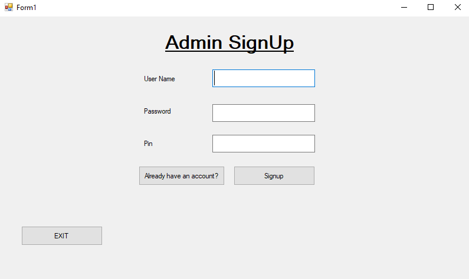
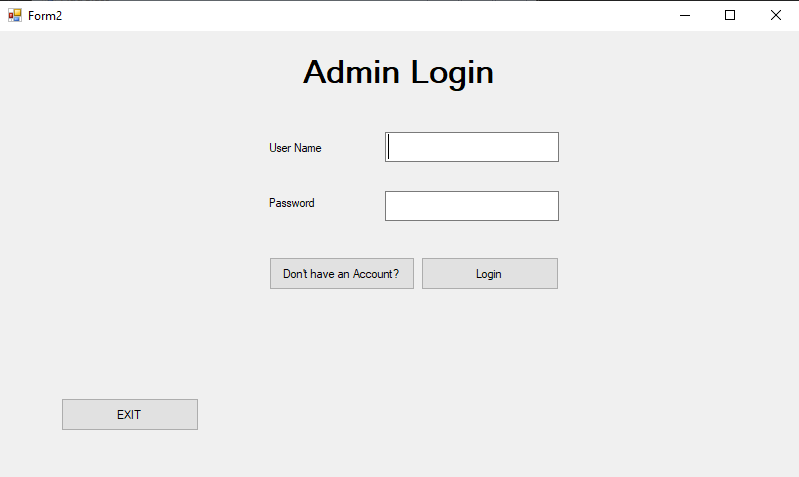
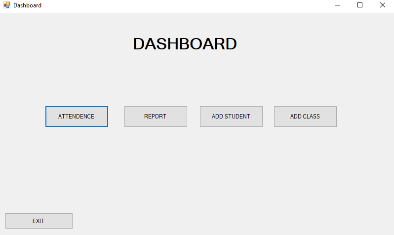
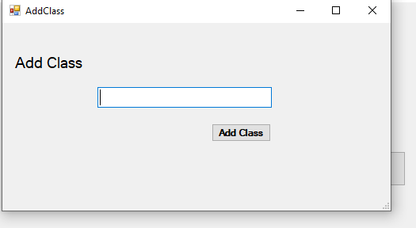
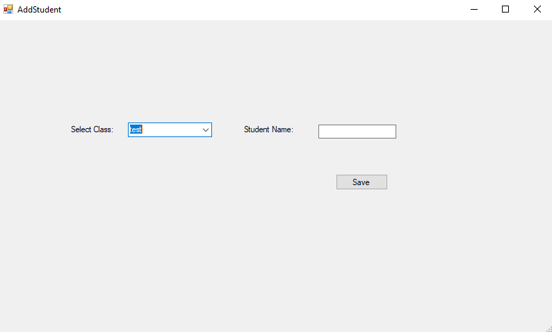
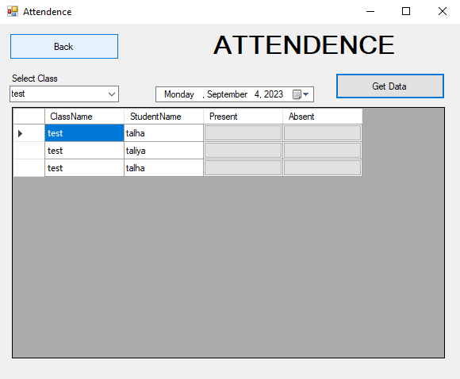
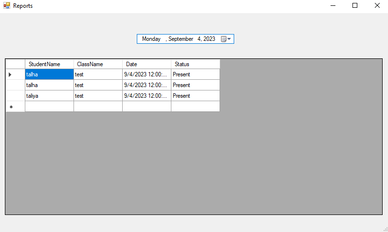

# Attendence Portal Windows App Craeted with c#
This was the final project for OOP course of 2nd sem (BSSE) at SMIU

## Screenshots of Project:

### Signup:
A user can signup himslef to the portal with a pin <b>(Hardcoded: 1234)</b>

### Login:
A simple Login Page  

### Dashboard:

### Add Class:
With this screen a new class can be added  

### Add Student:
With this screen a new student can be added to a dedicated class 

### Attendence:
With this screen a user can mark attendece 

### Report:
With this screen a user can see pervious marked attendece 

